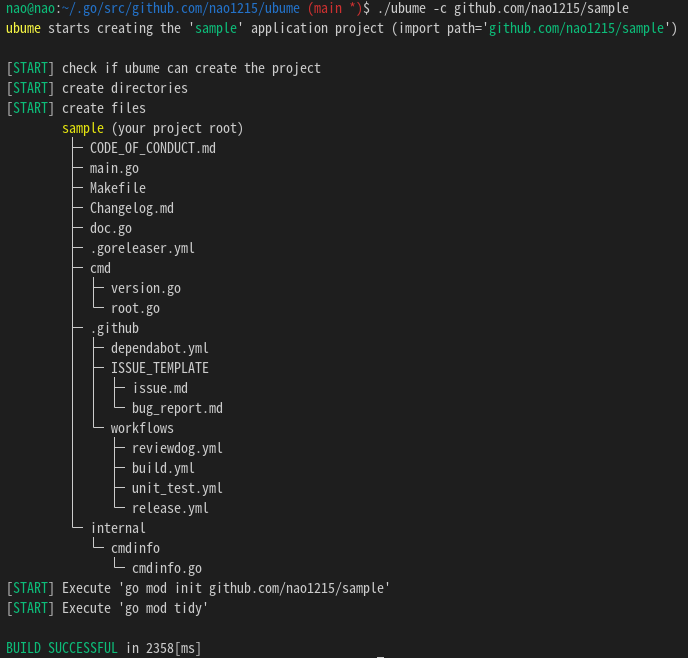

[](https://github.com/nao1215/ubume/actions/workflows/build.yml)  
[[日本語]](./doc/README.ja.md)
# ubume - Golang project template generator
ubume command generate golang project template at current directory. As of version 1.0.0, the ubume command can generate application and library projects. The automatically generated files include "Makefile for easy project management" and "GitHub Actions files (build, unit test)". However, it does not run "$ git init".
 
  
# How to install
## Step.1 Install golang
If you don't install golang in your system, please install Golang first. Check the [Go official website](https://go.dev/doc/install) for how to install golang.
## Step2. Install ubume
```
$ go install github.com/nao1215/ubume/cmd/ubume@latest
```
  
# How to use
## Generate application project
In the following example, the ubume command will generate a sample project. The binary name will be sample, and build using Makefile.
```
$ ubume github.com/nao1215/sample  ※ Argument is same as "$ go mod init"
ubume starts creating the 'sample' application project (import path='github.com/nao1215/sample')

[START] check if ubume can create the project
[START] create directories
[START] create files
        sample (your project root)
         ├─ Makefile
         ├─ Changelog.md
         ├─ cmd
         │  └─ sample
         │     ├─ main.go
         │     ├─ main_test.go
         │     └─ doc.go
         └─ .github
            └─ workflows
               ├─ build.yml
               └─ unit_test.yml

BUILD SUCCESSFUL in 6[ms]

$ cd sample
$ make build
$ ls
Changelog.md  Makefile  cmd  go.mod  sample

$ ./sample 
Hello, World

$ make test
env GOOS=linux go test -v -cover ./... -coverprofile=cover.out
=== RUN   TestHelloWorld
--- PASS: TestHelloWorld (0.00s)
PASS
coverage: 50.0% of statements
ok      github.com/nao1215/sample/cmd/sample    0.001s  coverage: 50.0% of statements
go tool cover -html=cover.out -o cover.html
```

## Generate library project
```
$ ubume --library github.com/nao1215/sample
ubume starts creating the 'sample' library project (import path='github.com/nao1215/sample')

[START] check if ubume can create the project
[START] create directories
[START] create files
        sample (your project root)
         ├─ sample_test.go
         ├─ Makefile
         ├─ Changelog.md
         ├─ doc.go
         ├─ sample.go
         └─ .github
            └─ workflows
               └─ unit_test.yml

BUILD SUCCESSFUL in 6[ms]
```

# Self-documented Makefile
The Makefile generated by the ubume command is [self-documenting](https://marmelab.com/blog/2016/02/29/auto-documented-makefile.html). When you run the make command, you will see the target list that exists in the Makefile. A help message is showed next to the target name.
```
$ make
build           Build binary 
clean           Clean project
fmt             Format go source code 
test            Start test
vet             Start go vet
```
If you want to add a new target, please comment with **"##"** next to the target. The string after "##" is extracted and used as a help message. An example is shown below.
```
build:  ## Build binary 
	env GO111MODULE=on GOOS=$(GOOS) $(GO_BUILD) $(GO_LDFLAGS) -o $(APP) cmd/sample/main.go

clean: ## Clean project
	-rm -rf $(APP) cover.out cover.html
```
# Contact
If you would like to send comments such as "find a bug" or "request for additional features" to the developer, please use one of the following contacts.

- [GitHub Issue](https://github.com/nao1215/ubume/issues)

# LICENSE
The ubume project is licensed under the terms of [the Apache License 2.0](./LICENSE).