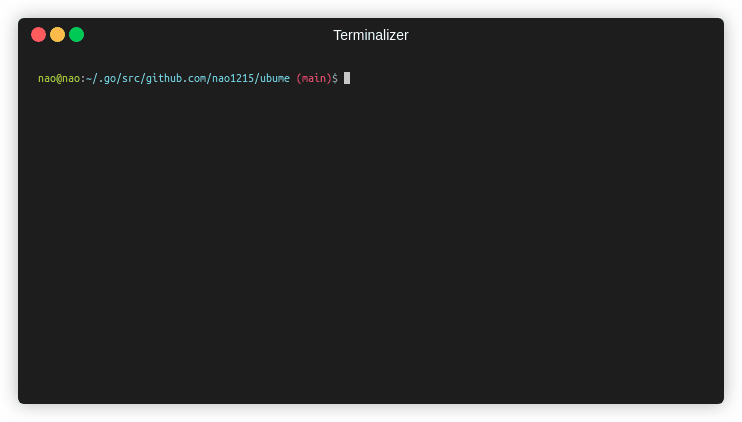

[](https://github.com/nao1215/mkgoprj/actions/workflows/build.yml)  
# mkgoprj - Golngプロジェクトテンプレートジェネレータ
mkgoprjコマンドは、golangプロジェクトテンプレートをカレントディレクトリに作成します。作成できるプロジェクトは、以下の３つです。
- ライブラリプロジェクト
- [cobra](https://github.com/spf13/cobra)を用いたCLIプロジェクト

自動生成するファイルには、「プロジェクト管理を簡単にするMakefile」と「GitHub Actionsのファイル（ビルド、ユニットテスト、リリース、レビュードッグ、dependabot）」が含まれます。ただし、"$ git init"は実行しません。  
  
 
  
# インストール方法
## Step1. Golangのインストール
Golangをシステムにインストールしていない場合は、まずはgolangをインストールしてください。インストール方法は、[Go公式サイト](https://go.dev/doc/install) で確認してください。  
  
## Step2. mkgoprjのインストール
```
$ go install github.com/nao1215/mkgoprj@latest
```
  
# 使い方
## アプリケーションプロジェクトの作成
以下の例では、mkgoprjコマンドはsampleプロジェクトを作成します。バイナリ名は"sample"で、ビルドにはMakefileを使います。
```
$ mkgoprj cli github.com/nao1215/sample  ※ 引数は"$ go mod init"と同じ。
mkgoprj starts creating the 'sample' application project (import path='github.com/nao1215/sample')

[START] check if mkgoprj can create the project
[START] create directories
[START] create files
        sample (your project root)
         ├─ CODE_OF_CONDUCT.md
         ├─ main.go
         ├─ Makefile
         ├─ Changelog.md
         ├─ .goreleaser.yml
         ├─ cmd
         │  ├─ version.go
         │  └─ root.go
         ├─ .github
         │  ├─ dependabot.yml
         │  ├─ ISSUE_TEMPLATE
         │  │  ├─ issue.md
         │  │  └─ bug_report.md
         │  └─ workflows
         │     ├─ reviewdog.yml
         │     ├─ build.yml
         │     ├─ unit_test.yml
         │     └─ release.yml
         └─ internal
            ├─ cmdinfo
            │  └─ cmdinfo.go
            ├─ completion
            │  └─ completion.go
            └─ print
               └─ print.go
[START] Execute 'go mod init github.com/nao1215/sample'
[START] Execute 'go mod tidy'

BUILD SUCCESSFUL in 2485[ms]

$ cd sample
$ make build
$ ls
CODE_OF_CONDUCT.md  Changelog.md  Makefile  cmd  go.mod  go.sum  internal  main.go  sample
```

## ライブラリプロジェクトの作成
$ mkgoprj library github.com/nao1215/sample
mkgoprj starts creating the 'sample' library project (import path='github.com/nao1215/sample')

[START] check if mkgoprj can create the project
[START] create directories
[START] create files
        sample (your project root)
         ├─ sample_test.go
         ├─ CODE_OF_CONDUCT.md
         ├─ Makefile
         ├─ Changelog.md
         ├─ sample.go
         └─ .github
            ├─ dependabot.yml
            ├─ ISSUE_TEMPLATE
            │  ├─ issue.md
            │  └─ bug_report.md
            └─ workflows
               ├─ reviewdog.yml
               └─ unit_test.yml
[START] Execute 'go mod init github.com/nao1215/sample'

BUILD SUCCESSFUL in 5[ms]

$ cd sample/
$ make test
env GOOS=linux go test -v -cover ./... -coverprofile=cover.out
=== RUN   TestHelloWorld
--- PASS: TestHelloWorld (0.00s)
PASS
coverage: 100.0% of statements
ok      github.com/nao1215/sample       0.002s  coverage: 100.0% of statements
go tool cover -html=cover.out -o cover.html
```

# 自己文書化されたMakefile
mkgoprjコマンドによって生成されるMakefileは、[自己文書化](https://postd.cc/auto-documented-makefile/)されています。makeコマンドを実行した時、Makefileのターゲットリストが表示されます。ターゲット名の横には、ヘルプメッセージが表示されます。

```
$ make
build           Build binary 
clean           Clean project
fmt             Format go source code 
test            Start test
vet             Start go vet
```
新しいターゲットを追加したい場合は、ターゲットの横に**"##"**から始まるコメントを書いてください。"##"以降の文字列が抽出され、ヘルプメッセージとして利用されます。以下に例を示します。
```
build:  ## Build binary 
	env GO111MODULE=on GOOS=$(GOOS) $(GO_BUILD) $(GO_LDFLAGS) -o $(APP) cmd/sample/main.go

clean: ## Clean project
	-rm -rf $(APP) cover.out cover.html
```

### シェル補完ファイルの自動生成 (bash, zsh, fish)
mkgoprjコマンドは、bash、zsh、fish向けのシェル補完ファイルを自動生成します。ユーザーがmkgoprjを実行した後、シェル補完ファイルがシステムに存在しない場合は、自動生成処理を開始します。シェル補完を有効にするには、シェルを再起動してください。

```
$ mkgoprj 
mkgoprj:INFO : append bash-completion file: /home/nao/.bash_completion
mkgoprj:INFO : create fish-completion file: /home/nao/.config/fish/completions/mkgoprj.fish
mkgoprj:INFO : create zsh-completion file: /home/nao/.zsh/completion/_mkgoprj
```

# 連絡先
「バグを見つけた場合」や「機能追加要望」に関するコメントを開発者に送りたい場合は、以下の連絡先を使用してください。

- [GitHub Issue](https://github.com/nao1215/mkgoprj/issues)

# ライセンス
mkgoprjプロジェクトは、[Apache License 2.0](./LICENSE)条文の下でライセンスされています。